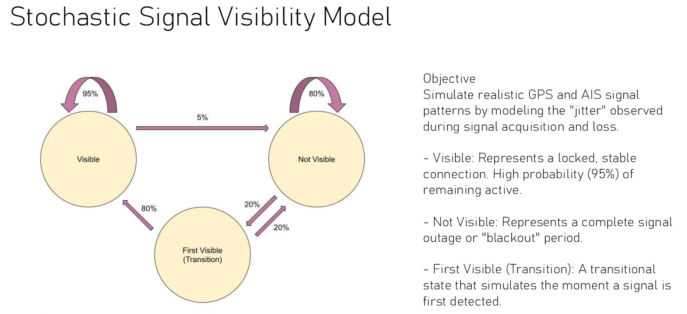

# AIS-Noiser

A Python tool for adding realistic noise and simulating data loss to AIS (Automatic Identification System) and ADS-B (Automatic Dependent Surveillance-Broadcast) tracking data. This tool is designed to create realistic test scenarios by simulating real-world sensor imperfections, signal dropouts, and measurement inaccuracies.

## Table of Contents

- [Overview](#overview)
- [Features](#features)
- [Requirements](#requirements)
- [Usage](#usage)
  - [Basic Usage](#basic-usage)
  - [Command-Line Arguments](#command-line-arguments)
  - [Examples](#examples)
- [Input Data Formats](#input-data-formats)
  - [AIS (2D) Format](#ais-2d-format)
  - [ADS-B (3D) Format](#ads-b-3d-format)
- [Output Files](#output-files)
- [How It Works](#how-it-works)
  - [Coordinate Noise](#coordinate-noise)
  - [Time Noise](#time-noise)
  - [Visibility Simulation](#visibility-simulation)
- [File Descriptions](#file-descriptions)
- [Validation](#validation)

## Overview

AIS-Noiser processes tracking data from maritime vessels (AIS) or aircraft (ADS-B) and applies configurable noise patterns to simulate real-world sensor behavior. The tool can:

- Add random positional noise to coordinates (latitude, longitude, and altitude)
- Introduce temporal noise to timestamps
- Simulate intermittent signal loss and data dropout
- Process both 2D (maritime) and 3D (aviation) datasets
- Generate separate output files per vehicle/aircraft while maintaining a consolidated output

## Features

- **Dual Mode Operation**: Supports both 2D AIS data (ships) and 3D ADS-B data (aircraft)
- **Configurable Noise Models**: Separate noise parameters for latitude, longitude, altitude, and time
- **Realistic Visibility Modeling**: Statistical model for simulating intermittent signal reception
- **Batch Processing**: Automatically groups data by vehicle identifier (MMSI for ships, ICAO hex for aircraft)
- **Data Integrity**: Preserves column structure and formats while applying transformations

## Requirements

- Python 3.7 or higher
- pandas
- numpy

## Usage

### Basic Usage

The program is run from the command line using Python:

```bash
python main.py [OPTIONS]
```

To view help information:

```bash
python main.py --help
```

or

```bash
python main.py -h
```

### Command-Line Arguments

| Argument | Type | Default | Description |
|----------|------|---------|-------------|
| `--file` | string | `2023-09-03_ais_top10.csv` | Path to the input CSV file |
| `--latnoise` | float | `100.0` | Maximum noise distance in meters for latitude |
| `--lonnoise` | float | `100.0` | Maximum noise distance in meters for longitude |
| `--altnoise` | float | `50.0` | Maximum noise distance in meters for altitude (3D mode only) |
| `--timenoise` | float | `20.0` | Maximum time noise in seconds |
| `--visible` | float | `0.95` | Probability (0-1) that a visible object remains visible |
| `--invisible` | float | `0.80` | Probability (0-1) that an invisible object remains invisible |
| `--stayvisible` | float | `0.80` | Probability (0-1) that a newly visible object stays visible |
| `-2d` | flag | enabled | Process data as 2D AIS format (maritime) |
| `-3d` | flag | disabled | Process data as 3D ADS-B format (aviation) |
| `-t` | flag | disabled | Allow time noise to be applied both forward and backward |

**Note**: By default, time noise is only added forward (future direction). Use the `-t` flag to allow negative time shifts as well.

### Examples

#### Example 1: Basic AIS Processing with Default Settings

```bash
python main.py -2d --file 2023-09-03_ais_top10.csv
```

This processes the AIS file with:
- 100m default positional noise in both lat/lon
- 20 default seconds forward-only time noise
- 95% default chance visible objects stay visible
- 80% default chance invisible objects stay invisible

#### Example 2: Custom Noise Parameters for AIS

```bash
python main.py -2d --file my_ais_data.csv --latnoise 150.0 --lonnoise 150.0 --timenoise 30.0 --visible 0.90 --invisible 0.85
```

This applies:
- 150m of positional noise
- 30 seconds of forward-only time noise
- 90% visibility retention rate
- 85% invisibility retention rate

#### Example 3: ADS-B Processing with 3D Data

```bash
python main.py -3d --file adsb_flights.csv --latnoise 100.0 --lonnoise 100.0 --altnoise 50.0 --timenoise 20.0 --visible 0.95 --invisible 0.80 --stayvisible 0.80 -t
```

This processes aircraft data with:
- 100m horizontal noise
- 50m altitude noise
- 20 seconds of bidirectional time noise (forward and backward)
- Standard visibility parameters

#### Example 4: High Noise Scenario

```bash
python main.py -2d --file test_data.csv --latnoise 500.0 --lonnoise 500.0 --timenoise 60.0 --visible 0.70 --invisible 0.60 -t
```

This creates a challenging scenario with:
- 500m positional errors
- ±60 seconds temporal uncertainty
- Significant signal dropout (30% chance of losing visible signals)

#### Example 5: Minimal Noise for Testing

```bash
python main.py -2d --file clean_data.csv --latnoise 10.0 --lonnoise 10.0 --timenoise 1.0 --visible 0.99 --invisible 0.95
```

Light noise for validation purposes:
- Only 10m positional noise
- 1 second time noise
- Minimal data loss

## Input Data Formats

### AIS (2D) Format

AIS CSV files must contain the following columns:

- `MMSI`: Maritime Mobile Service Identity (unique vessel identifier)
- `LAT`: Latitude in decimal degrees
- `LON`: Longitude in decimal degrees
- `BaseDateTime`: Timestamp in ISO 8601 format (YYYY-MM-DD HH:MM:SS)

Additional columns are preserved but not modified.

**Example AIS CSV:**
```csv
MMSI,LAT,LON,BaseDateTime,SOG,COG,Heading
123456789,35.6895,139.6917,2023-09-03 12:00:00,12.5,180.0,182
123456789,35.6896,139.6918,2023-09-03 12:01:00,12.6,180.5,182
```

### ADS-B (3D) Format

ADS-B CSV files must contain the following columns:

- `icao_hex`: ICAO 24-bit address (unique aircraft identifier)
- `latitude`: Latitude in decimal degrees
- `longitude`: Longitude in decimal degrees
- `altitude`: Altitude in meters
- `date`: Date in YYYY-MM-DD format
- `time`: Time in HH:MM:SS format

Additional columns are preserved but not modified.

**Example ADS-B CSV:**
```csv
icao_hex,latitude,longitude,altitude,date,time,callsign
a12345,35.6895,139.6917,10000,2023-09-03,12:00:00,UAL123
a12345,35.6896,139.6918,10050,2023-09-03,12:01:00,UAL123
```

## Output Files

The program generates two types of output files:

### 1. Per-Vehicle Files

Each unique vessel (MMSI) or aircraft (ICAO hex) gets its own output file:

- **AIS Mode**: `<MMSI>_noised.csv` (e.g., `123456789_noised.csv`)
- **ADS-B Mode**: `<icao_hex>_noised.csv` (e.g., `a12345_noised.csv`)

These files contain only the records for that specific vehicle that passed the visibility filter, with noise applied.

### 2. Consolidated File

A single combined file containing all vehicles:

- Format: `<original_filename>_noised.csv`
- Example: `2023-09-03_ais_top10_noised.csv`

### File Naming Collision Handling

If output files already exist, the program automatically appends a number:
- First duplicate: `filename (1).csv`
- Second duplicate: `filename (2).csv`
- And so on...

## How It Works

### Coordinate Noise

The noise model adds random offsets to each coordinate independently:

1. **Latitude/Longitude**: Random offset within ±N meters (configurable)
2. **Calculation Method**: 
   - Uses WGS84 Earth radius (6,356,752.314245 meters)
   - Converts meter offsets to angular displacement
   - Accounts for longitude convergence at different latitudes
   - Applies uniform random distribution within specified bounds

3. **Altitude** (3D mode only): Random offset within ±N meters

**Formula**:
```
Δlat (radians) = offset_meters / earth_radius
Δlon (radians) = offset_meters / (earth_radius × cos(latitude))
new_coordinate = original_coordinate + Δ (converted to degrees)
```

### Time Noise

Temporal noise simulates clock drift and synchronization errors:

- **Forward-only mode** (default): Adds random delay between 0 and +N seconds
- **Bidirectional mode** (`-t` flag): Adds random offset between -N and +N seconds
- Uses uniform random distribution

### Visibility Simulation

The visibility model simulates intermittent signal reception using a state machine:

**States:**
- **Visible**: Object is currently being tracked
- **Invisible**: Object signal is lost

**Transitions:**
1. **Visible → Visible**: Probability = `visible_chance` (default 95%)
2. **Visible → Invisible**: Probability = 1 - `visible_chance` (default 5%)
4. **Invisible → Invisible**: Probability = `invisible_chance` (default 80%)
3. **Invisible → Visible**: Probability = 1 - `invisible_chance` (default 20%)
5. **First visibility after dropout**: Uses `stay_visible_chance` (default 80%) to model gradual signal reacquisition

**Behavior**:
- Records are only written when the object is "visible"
- Each vehicle/aircraft has independent visibility state
- State persists across consecutive records for the same vehicle



The diagram above illustrates the state transitions for the visibility simulation model, showing how objects transition between visible and invisible states based on the configured probabilities.

## File Descriptions

### Core Files

- **[main.py](main.py)**: Entry point; orchestrates data loading, processing, and output generation
- **[noiser.py](noiser.py)**: Implements coordinate and time noise functions
- **[visible.py](visible.py)**: Contains visibility state machine logic
- **[helper_functions.py](helper_functions.py)**: Utility functions for file naming and argument parsing
- **[Settings.py](Settings.py)**: Configuration data class for storing program parameters
- **[output_validation.py](output_validation.py)**: Tools for validating output quality and statistics

## Validation

The `output_validation.py` script provides tools to analyze the quality of noised data:

```python
from output_validation import validate_noise_application

validate_noise_application(
    original_csv='original_data.csv',
    output_csv='original_data_noised.csv'
)
```

**Validation Metrics**:
- Record retention rates per vehicle
- Temporal gap analysis
- Coordinate drift statistics
- Signal dropout patterns

## Troubleshooting

### Common Issues

**Problem**: Time noise going negative before epoch
- **Solution**: Ensure your timestamps are reasonable and reduce `--timenoise` value

**Problem**: All records filtered out
- **Solution**: Increase `--visible` and `--stayvisible` parameters, or reduce `--invisible`

**Problem**: No altitude column in 2D mode
- **Solution**: Use `-2d` flag for AIS data; altitude is only processed in `-3d` mode

## License

This software is part of the JFN Groundtruth Simulator project.